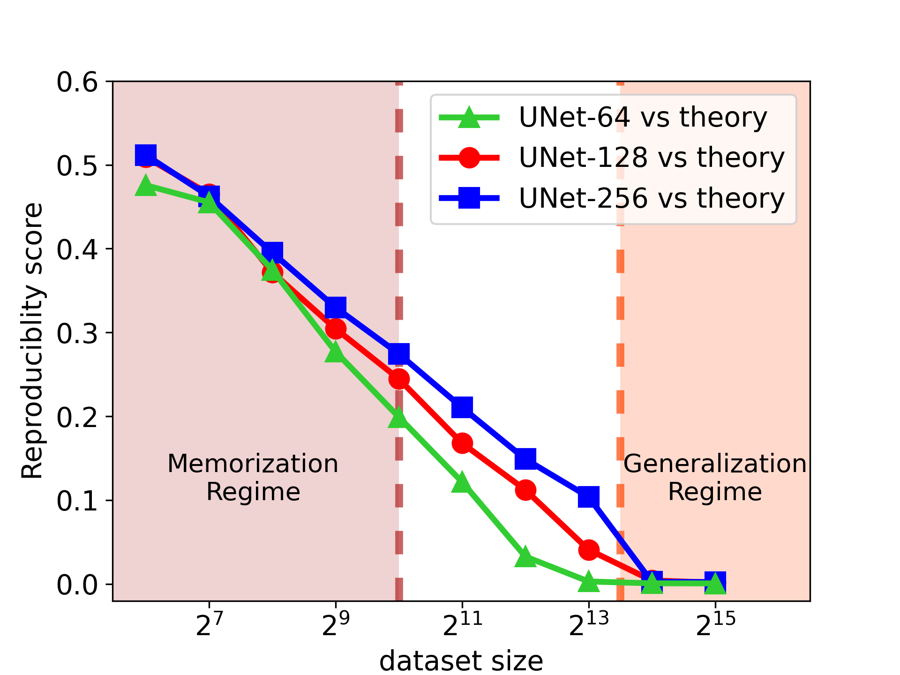

# Understanding Generalizability of Diffusion Models through Low-dimensional Distribution Learning

This is an official implementation of the paper 
  1. [The Emergence of Reproducibility and Consistency in Diffusion Models](https://arxiv.org/abs/2310.05264) **NeurIPS 2023 workshop Best Paper,  ICML 2024**
  2. [Diffusion Models Learn Low-Dimensional Distributions via Subspace Clustering](https://arxiv.org/abs/2409.02426)

The codebase mainly focuses on the implementation of three main figures from these two papers, including:
1. "Memorization" and "Generalization" regimes for unconditional diffusion models. (Figure 2 in [Paper 1](https://arxiv.org/abs/2310.05264))
2. Convergence of the optimal denoiser. (Figure 4 Left in [Paper 1](https://arxiv.org/abs/2310.05264))
3. Similarity among different unconditional diffusion model settings in generalization regime. (Figure 6 and Figure 12 in [Paper 1](https://arxiv.org/abs/2310.05264))
4. Low-rank property of the denoising autoencoder of trained diffusion models. (Figure 3 in [Paper 2](https://arxiv.org/abs/2409.02426))

For the implementation of Figure 1 (Correspondence between the singular vectors of the Jacobian of the DAE and semantic
image attributes) in [Paper 2](https://arxiv.org/abs/2409.02426), please go through our concurrent work [Exploring Low-Dimensional Subspaces in Diffusion Models for Controllable Image Editing](https://arxiv.org/abs/2409.02374), the codebase could be found [here](https://github.com/ChicyChen/LOCO-Edit).

### Requirements

```bash
conda env create -f edm/environment.yml -n generalizability
conda activate generalizability
```

## "Memorization" and "Generalization" regimes for unconditional diffusion models. 

<div align="center">
     
     
</div>

Slightly different from Figure 2 in [Paper 1](https://arxiv.org/abs/2310.05264), the code we release is under a finetuning setting: the training dataset is generated from a pre-trained diffusion model (teacher model). 

### Create Dataset

Create a dataset of specific dataset size as follows:

```bash
# generate images from teacher model
python edm/generate.py --outdir=out --seeds=0-49999 --batch=64 --network=https://nvlabs-fi-cdn.nvidia.com/edm/pretrained/edm-cifar10-32x32-uncond-vp.pkl

# create dataset with different size
python edm/dataset_tool.py --source=out --max-images=128 --dest=datasets/synthetic-cifar10-32x32-n128.zip
```

### Training

```bash
torchrun --standalone --nproc_per_node=1 edm/train.py --outdir=training --data=datasets/synthetic-cifar10-32x32-n128.zip --cond=0 --arch=ddpmpp --duration 50 --batch 128 --snap 500 --dump 500 --precond vp --model_channels 64
```

### Evaluation

All checkpoints we released can be found [here](https://www.dropbox.com/scl/fo/m8tf61cengcp1qyevwiwv/AKoLuvIY5Fx0Tz1g8eRFWoI?rlkey=x7t1iqunpzofddgv533bx48q8&st=wtfeg1a9&dl=0), and all training dataset we released can be found [here](https://www.dropbox.com/scl/fo/fqwgl5pvqe4jgvuw945k6/AHEH9P8AYVYhMx_ABTclVC4?rlkey=frsgki669ny9lmxiwlpafanhg&st=kbgrn9za&dl=0)

```bash

### generate image from diffusion model, the seeds is different from the one (which is 0-49999) used to generate training images from teacher model.
python edm/generate.py --outdir=evaluation/ddpm-dim64-n64 --seeds=100000-109999 --batch=64 --network=training/ckpt/ddpm-dim64-n64.pkl

python edm/generate.py --outdir=evaluation/ddpm-dim128-n64 --seeds=100000-109999 --batch=64 --network=training/ckpt/ddpm-dim128-n64.pkl

### Calculate SSCD feature 
torchrun --standalone --nproc_per_node=1 edm/sscd.py feature --images ./evaluation/ddpm-dim64-n64 --features ./evaluation/sscd-dim64-n64.npz

torchrun --standalone --nproc_per_node=1 edm/sscd.py feature --images ./evaluation/ddpm-dim128-n64 --features ./evaluation/sscd-dim128-n64.npz

torchrun --standalone --nproc_per_node=1 edm/sscd.py feature --images datasets/synthetic-cifar10-32x32-n64.zip --features ./evaluation/sscd-training-dataset-synthetic-cifar10-32x32-n64.npz

# Compute reproducibility score
python edm/sscd.py rpscore --source ./evaluation/sscd-dim128-n64.npz --target ./evaluation/sscd-dim64-n64.npz

# Compute generalization score
python edm/sscd.py mscore --source ./evaluation/sscd-dim128-n64.npz --target ./evaluation/sscd-training-dataset-synthetic-cifar10-32x32-n64.npz

```

## Convergence of the optimal denoiser.

<div align="center">
     
</div>

We implement the optimal denoiser (derived from the score function of the empirial distribution). And compare the RP score between real diffusion model and the optimal denoiser.

```bash
### generate image from optimal denoiser
python edm/generate.py --outdir=evaluation/memorization-n64 --seeds=100000-109999 --batch=64 --optimal_denoiser --dataset=datasets/synthetic-cifar10-32x32-n64.zip --network=https://nvlabs-fi-cdn.nvidia.com/edm/pretrained/edm-cifar10-32x32-uncond-vp.pkl

### Calculate SSCD feature 
torchrun --standalone --nproc_per_node=1 edm/sscd.py feature --images ./evaluation/memorization-n64 --features ./evaluation/sscd-memorization-n64.npz

### Compute reproducibility score
python edm/sscd.py rpscore --source ./evaluation/sscd-dim128-n64.npz --target ./evaluation/sscd-memorization-n64.npz

```

## Similarity among different unconditional diffusion model settings in generalization regime. 

<div align="center">
     
</div>

We provide generated samples from those different diffusion models [here](https://www.dropbox.com/scl/fo/xq0yvr92ohzb6ov313928/ANo8GzZ5GybCrzJRb2P1qU8?rlkey=iaf6316aezz4wznigj4ir2v29&st=psa7il3e&dl=0). To generate new samples, you need to go through their own github repo and use the same initial noise for generation. 

```bash

### Calculate SSCD feature 
torchrun --standalone --nproc_per_node=1 edm/sscd.py feature --images ./samples/ddpmv4 --features ./evaluation/sscd-ddpmv4.npz

torchrun --standalone --nproc_per_node=1 edm/sscd.py feature --images ./samples/ddpmv6 --features ./evaluation/sscd-ddpmv6.npz


# Compute reproducibility score
python edm/sscd.py rpscore --source ./evaluation/sscd-ddpmv4.npz --target ./evaluation/sscd-ddpmv6.npz


```

## Low-rank property of the denoising autoencoder of trained diffusion models.

<div align="center">
     
     
</div>
These figures illustrate the low-dimensionality of the jacobian of the denoising autoencoder (DAE) trained on real dataset and Mixture of Low Rank Gaussian distribution (MoLRG).

To training diffusion model with MoLRG:
```bash
torchrun --standalone --nproc_per_node=1 edm/trainMoLRG.py --outdir training --path datasets  --img_res 4 --class_num 2 --per_class_dim 7 --sample_per_class 350 --embed_channels 128
```

To Evaluate rank of the jacobian:
```bash
torchrun --standalone --nproc_per_node=1 edm/jacobian.py --network_pkl <path/to/pkl>

e.g.
torchrun --standalone --nproc_per_node=1 edm/jacobian.py --network_pkl https://nvlabs-fi-cdn.nvidia.com/edm/pretrained/edm-cifar10-32x32-uncond-vp.pkl
```

Notably, built upon [NVlabs/edm](https://github.com/NVlabs/edm), our codebase is compatible with all training ckpts released from their repo, where you could find [here](https://nvlabs-fi-cdn.nvidia.com/edm/pretrained/) and [here](https://nvlabs-fi-cdn.nvidia.com/edm/pretrained/baseline/).

## Acknowledgements
This repository is highly based on [NVlabs/edm](https://github.com/NVlabs/edm).

## BibTeX
```
@inproceedings{
  zhang2024the,
  title={The Emergence of Reproducibility and Consistency in Diffusion Models},
  author={Huijie Zhang and Jinfan Zhou and Yifu Lu and Minzhe Guo and Peng Wang and Liyue Shen and Qing Qu},
  booktitle={Forty-first International Conference on Machine Learning},
  year={2024},
  url={https://openreview.net/forum?id=HsliOqZkc0}
}

@article{wang2024diffusion,
  title={Diffusion models learn low-dimensional distributions via subspace clustering},
  author={Wang, Peng and Zhang, Huijie and Zhang, Zekai and Chen, Siyi and Ma, Yi and Qu, Qing},
  journal={arXiv preprint arXiv:2409.02426},
  year={2024}
}
```
